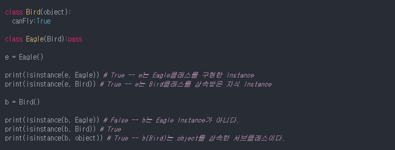

## [파이썬 기초]에 대해서 

 마지막 수정 이원석: 2020-10-09

### [개요]

- 여러 파이썬 입문 사이트나 책 등에 적혀있는 파이썬의 기초에 대해서 정리해두려고 한다.

- 참고한 자료들은 아래와 같다.

  > "점프 투 파이썬", "제대로 파이썬" 등의 인터넷 자료들 및 서적들
  >
  > 어쩌다 랩원들에게 주워들은 파이썬 관련 내용들 (꼭 파이썬이 아닌 내용도 있을 수 있다)

### [본문]

- **파이썬의 내장 함수들에 대하여**

  - 파이썬에는 이미 정말 많은 내장함수들이 만들어져있다.

    ~~~python
    print("hello")  # 객체의 내용을 출력
    type("hello")  # 객체의 타입을 알려줌
    dir("hello")  # 객체가 가지는 속성과 메소드 정보 확인 가능
    help(dir)  # 함수나 객체에 대한 정보 확인 가능
    ~~~

  - enumerate

    - 색인을 함께 가져올 수 있다.

    ~~~python
    some_list = ['foo', 'bar', 'baz']
    mapping = dict((v,i) for i,v in enumerate(some_list))  # 이렇게 한 번에 만들 수 있다니 몰랐네
    
    >> {'foo': 1, 'bar' :2, 'baz': 0}
    ~~~

  - zip

    - 넘겨 받는 순차 자료형 여러개를 짝지어서 반환

    ~~~python
    seq1 = ['foo','bar','baz']
    seq2 = ['one', 'two', 'three']
    zip(seq1, seq2)
    
    >> [('foo', 'one'), ('bar', 'two'), ('baz', 'three')]
    
    (심화과정1)
    for i, (a,b) in enumerate(zip(seq1,seq2)):
    	print("%d: %s, %s" % (i,a,b))  # 포멧팅은 이제 이런 방법 안 씀. [파이썬 코딩의 기술] 서적 참고
    
    (심화과정2)
    pitchers = [('Nolan', 'Ryan'), ('Roger', 'Clemens'), ('Schilling', 'Curt')]
    first_names, last_names = zip(*pitchers)
    # 이런 식으로 다시 쪼갤 수도 있음.
    # 쪼갤 때는 * 표시가 있어야하나 봄
    ~~~

- **파이썬 사전 자료형 및 집합 자료형**

  - **del, pop, update** : update는 하나의 사전을 다른 사전과 합칠 때에 사용

    ~~~python
    (example1)
    mapping = {}
    for key, value in zip(key_list, value_list):
        mapping[key] = value
        
    (example2)
    mapping = dict(zip(range(5), reversed(range(5))))
    ~~~

  - **setdefulat**라는 내장 함수를 사용하면 사전에 내포된 key를 쉽게 다룰 수 있다.

    - 존재하면 기존 key에 추가하고, 없으면 key자체를 추가한다.

    ~~~python
    words = ['apple', 'bat', 'bar', 'atom', 'book']
    by_letter = {}
    for word in words:
        letter = word[0]
        if letter not in by_letter:
            by_letter[letter] = [word]
        else:
            by_letter[letter].append(word)
            
    (setdefault 사용시 if-else 구문이)        
    by_letter.setdefault(letter, []).append(word)
    ~~~

  - 사전자료형을 다룰 때에 => **| (합집합), & (교집합), - (차집합), ^ (대칭차집합)**

- **기본 자료형들의 내포 기능**

  - 리스트 내포

  ~~~python
  strings = ['a', 'as', 'bat', 'car', 'dove', 'python']
  [x.upper() for x in strings if len(x) > 2]
  ~~~

  - 사전 내포

  ~~~python
  strings = ['a', 'as', 'bat', 'car', 'dove', 'python']
  loc_mapping = {val: index for index, val in enumerate(strings)}
  # 동일표현
  loc_mapping = dict((val, idx) for idx, val in enumerate(strings))
  ~~~

  - 집합 내포

  ~~~python
  strings = ['a', 'as', 'bat', 'car', 'dove', 'python']
  unique_lengths = {len(x) for x in strings}
  ~~~

  - 중첩된 리스트 내포

  ~~~python
  some_tuples = [(1,2,3),(4,5,6),(7,8,9)]
  flattened = [x for tup in some_tuples for x in tup]
  # 해설) 좀 어려워보이긴 하는데 앞에 x를 빼고 생각하면 이중구문에서의 순서와 같음.
  [[x for x in tup] for tup in some_tuples]
  # 해설) 이렇게 쓰면 리스트가 여러개 만들어진다는 차이가 있음을 기억
  ~~~

  

- **파이썬 상식 1**
  - 파이썬의 모든 것은 `객체`이다.
  - 객체는 클래스를 통해 생성되며, 객체의 타입이란 객체를 만든 클래스를 의미한다.
  - 객체는 클래스에서 지정한 속성과 메소드를 가진다.

- **파이썬 상식 2**
  - 파이썬은 스크립트 언어, 인터프리터 언어이다. (한 번에 하나의 명령어씩 순차적으로 실행)
  - 파이썬은 접착 언어로써의 성능이 우수하다. (글루코드로 활용해 C/C++ 등과의 통합이 쉬움)
  - Java나 C++보다는 많이 느려서 실시간 거래 시스템 같은 곳에서는 사용하기 불편하다.
  - syntatic sugar(용어) : 기존에 비해 편리하고 타이핑도 간편해지는 프로그래밍 문법

- **필수적인 파이썬 라이브러리**
  - NumPy
    - 빠르고 효율적인 다차원 배열 객체, 파이썬을 C,C++,포트란 등과 통합하는 도구
    - 선형대수 계산, 푸리에 변환, 난수 발생기
    - 사이트 : numpy-discussion
  - pandas
    - 풍부한 자료 구조와 함수를 제공
    - 파이썬에 강력한 데이터 분석 환경을 제공
    - 금융 데이터 분석 애플리케이션용으로 설계됨
    - 사이트 : pystatsmodels, pydata
  - matplotlib
    - 출판물에 필요한 그래프를 만드는데 초점이 맞춰짐.
    - IPython에 통합되어 있음 : 인터랙티브
  - IPython
    - 인터랙티브한 환경 제공
    - 파이썬 셸을 제공해서 코딩을 편하게 도와줌
    - 웹브라우저와 연결 가능한 노트북 제공
    - 병렬 분산 컴퓨팅을 위한 기반 구조 제공
  - SciPy
    - 과학 계산 영역의 여러  기본 문제를 다루는 패키지 모음
    - 수치 적분, 미분방적식 해법기
    - 선형대수, 매트릭스 분해
    - 인라인 C++코드를 사용하는 도구
    - NumPy와 함께 사용하여 MATLAB을 완벽하게 대체 가능
    - 사이트 : scipy-user
  - PyPI 또는 conda 등에서 손쉽게 새로운 파이썬 라이브러리를 찾아볼 수 있다.

- **파이썬 상식 3**

  - 파이썬의 큰 특징 중 하나는 `공백 문자`

    - 가독성을 크게 향상시키고 파이썬 사용자들끼리의 코드를 유사해지게 만들어 줌.
    - 보통 세미콜론이 필요없지만, 한 줄에 여러 문장을 쓸 때에는 구분을 위해서 세미콜론 필요 (지양하자)

  - 파이썬은 참조에 의한 전달이 이루어진다. (아래 예시)

    ~~~python
    a = [10, 20, 30]
    b = a
    a.append(40)
    print(b)
    
    >> [10, 20, 30, 40]
    ~~~

    - 위의 결과처럼 `a`의 값들이 그대로 `b`로 복사되는 것이 아니고, 같은 참조를 가지게 되는 것을 알 수 있음.
    - 또한 함수 내에서 인자의 내부 값을 바꿀 수도 있음. 참조에 의한 전달이기 때문에.

  - 파이썬의 함수는 여러 개의 일반 인자와 키워드 인자를 받을 수 있다.

    - 키워드 인자는 일반 인자 뒤에 와야한다.
    - 키워드 인자끼리는 순서의 제약이 없으므로 이름을 기억하고 있다면 순서는 기억 못해도 됨

- **파이썬 상식 4**
  
  - 파이썬 객체의 타입은 `type()` 함수나 `isinstance()` 함수를 활용해 확인해 볼 수 있다.
  
    - 둘의 차이점은 아래 코드를 참고
  
      
  
  - `isiterable()` 함수를 이용해서 객체의 iterable 여부를 확인해 볼 수 있다.
  
  - `bisect.insort()`를 사용하면 정렬된 상태로 리스트에 값을 추가할 수 있다. (하지만 추가할 리스트가 이미 정렬되어 있어야한다.)

- **파이썬 상식 5**

  - 파이썬에서 `==`, `!=` 와 `is`, `is not` 은 엄연히 다르게 작동한다.

    - 전자의 두 개는 객체 사이의 값이 정말 같은 지 다른 지를 판단하고, 
    - 후자의 두 개는 객체가 같은 걸 참조하고 있는 지를 판단한다. (근데 기억해둘 건, 파이썬에서 int나 str 같은 애들은 single 참조를 가짐)

  - 문자열 앞에 r를 써서 문자열을 그 자체로 읽도록 할 수도 있다. (이 경우, 이스케이프문들은 모두 무시)

    ~~~python
    print(r"ignore \n\n\n")
    
    >> ignore \n\n\n
    ~~~

  - pass의 경우 흐름 제어문에서 **아무것도 하지 않음**을 의미. 나중에 코도를 추가하기 위해 비워두는 플레이스 홀더의 역할로 많이 쓰인다.

- **파이썬 외 상식 1**
  - 파이썬 파일의 맨 앞에 `#!/bin/env python`을 입력함으로서 `which python`을 쳤을 때 나오는 파이썬을 자동 실행되게 할 수 있다.
    - 또는 당연히 명시적으로 파이썬 경로를 써줄 수도 있다.
  - bash command에서 `vim 'which quse'`을 입력함으로써 해당 파일을 아무 곳에서나 열어볼 수 있다. 
    - 따옴표를 썼지만 정확히는 키보드 왼쪽 위의 ` 표시이다.

### [마치며]

- 너무 뻔한 것들은 적지 않으려 했으나, 그냥 손 가는대로 적은 것들도 있다.